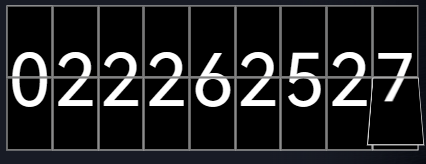

## Example

script:

```js
import FlipNumber from "flipdown-number";
let a = 0;
const FlipNumberClass = new FlipNumber(container, {
  initValue: "0", //default number
  minBit: 4,
});

// update number
setTimeout(() => {
  FlipNumberClass.set(++a);
}, 1000);

// before unmount
FlipNumberClass.destory();
```

styles:

```js
// main.js
import "flipdown-number/dist/index.css";
```

example for the other style:

```scss
// overrides.scss

.FlipDownNumberItem {
  margin-left: 4px;
  width: 50px;
  height: 68px;
  line-height: 68px;
  color: #c5d5ff;
  background: linear-gradient(to top, #2c3f6f, #14161e);
  box-sizing: border-box;
  .top {
    border: 2px solid #2c3f6f;
    border-bottom: 1px solid #000;
    border-radius: 4px;
    background: linear-gradient(to top, #2c3f6f, #14161e);
    .box_3d {
      .front {
        background: linear-gradient(to top, #2c3f6f, #14161e);
      }
      .back {
        background: linear-gradient(to top, #14161e, #2c3f6f);
      }
    }
  }
  .bottom {
    background: linear-gradient(to top, #14161e, #2c3f6f);
    border: 2px solid #2c3f6f;
    border-top: 1px solid #000;
    border-radius: 4px;
  }
}
```
